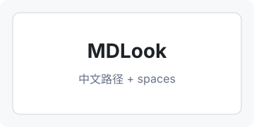

# Local Images

This image uses a local relative path and should render:

This image uses Chinese characters and a space in the filename:

This image is missing and should become a lightweight placeholder:

This remote image should be blocked:

