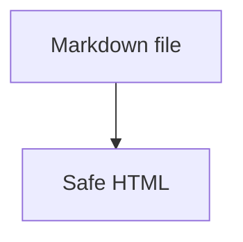

# 会议笔记 Notes

## Decisions

- [x] Keep local images enabled.
- [ ] Decide whether remote images should remain off by default.
- [x] Document install and reset commands.

## Details

中文、English, inline `code`, ==高亮==, ~~删除线~~, and escaped \*stars\* should render together.

> [!TIP]
> Use Finder Space preview for the fastest manual check.

```yaml
app: MDLook
rendering: true
remoteImages: false
```



Inline math $a^2 + b^2 = c^2$ stays as source text.

[^note]: A note-style document often mixes lists, code, callouts, and footnotes.

Reference this footnote here[^note].

