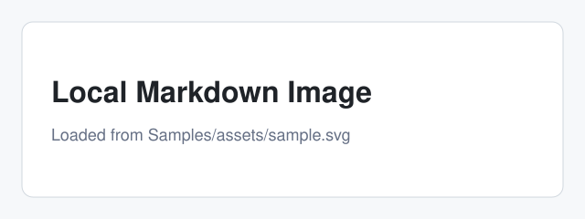

# MDLook Example README

> [!NOTE]
> This document behaves like an open-source project README.

MDLook renders **Markdown** for Finder Quick Look. It keeps raw HTML out, resolves local images, and makes links visibly different:

- External link: [Swift Markdown](https://github.com/swiftlang/swift-markdown)
- Local link: [basic sample](basic.md)
- Mail link: <mailto:hello@example.com>
- Inline code: `qlmanage -p Samples/basic.md`

## Install

```bash
Scripts/install-dev.sh
qlmanage -r cache
```

## Feature Matrix

| Feature | Status | Notes |
| :--- | :---: | ---: |
| Local images | Ready | same folder |
| Remote images | Optional | off by default |
| Mermaid | Source only | safe preview |

## Screenshot



## Terms

Renderer
: Converts Markdown AST nodes into controlled HTML.

Security
: Removes raw HTML and blocks remote resources unless explicitly enabled.

The formula H~[2]~O and E = mc^2^ should stay readable without executing scripts.

