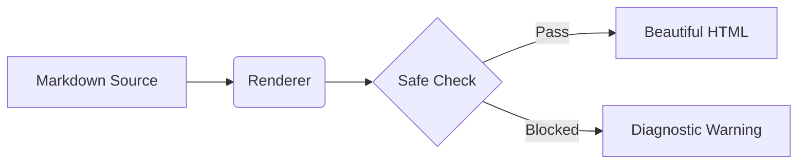

# MDLook 渲染回归测试文档 (Regression Test)

本文件是 Markdown 快速预览插件的核心回归测试样本，涵盖了 MDLook 目前所支持的**所有渲染特性**与样式优化。在每次修改渲染器后，请在 Finder 中选中本文件并按 `空格键`，以直观地核对各项视觉排版与功能。

---

## 1. 基础文本与排版 (Typography)

段落的字间距和行高已进行了舒适化调整。以下是各种行内文本的样式：

- **粗体 (Strong)**：这是 **加粗文本**，用于强调核心概念。
- *斜体 (Emphasis)*：这是 *斜体文本*，通常用于引入专业术语。
- ~~删除线 (Strikethrough)~~：这是 ~~已过时的废弃文本~~。
- `行内代码 (Inline Code)`：使用 `let test = true` 描述简短的代码符号。
- ==荧光笔高亮 (Highlight)==：使用 ==具有纸质书划线质感的荧光高亮== 涂抹重要句子。

### 上下标测试 (Subscript & Superscript)
- 水的化学式是 H~[2]~O。
- 爱因斯坦质能方程是 E = mc^2^。

### 转义字符测试 (Escaped Characters)
- 应当按字面显示转义后的星号 \*stars\*、中括号 \[brackets\] 和反引号 \`ticks\`，而不是被当成 Markdown 标记。

---

## 2. 定义列表 (Definition List)

定义列表应该排版清晰，概念项加粗，定义项缩进并支持行内样式：

HTML
: 超文本标记语言（HyperText Markup Language），网页的基础骨架。

CSS
: 层叠样式表（Cascading Sheets），用于给网页披上华丽的外衣，支持 ==荧光笔== 标记。

Swift
: 苹果公司开发的现代、安全、高效的系统编程语言。

---

## 3. 链接与安全性 (Links & Security)

MDLook 能够对各种链接进行分类修饰，并自动拦截有安全隐患的链接：

- **普通外部链接**：访问 [MDLook GitHub 官网](https://github.com/swiftlang/swift-markdown) (应带右上角外部跳转箭头 `↗`)。
- **电子邮箱链接**：如有疑问，请联系 [mailto:support@example.com](mailto:support@example.com) (应带邮件信封图标 `✉`)。
- **自动检测链接**：直接书写 https://example.com/docs 将自动转化为可点击的超级链接。
- **危险链接中和**：带有 XSS 脚本隐患的链接，如 [点击攻击](javascript:alert("hack"))，应当被安全中和（地址替换为 `#`，文字带中划线，鼠标悬浮提示 `Blocked unsafe link` 且不可点击）。

---

## 4. 引用块与 GitHub 风格呼出块 (Quotes & Callouts)

### 普通引用块 (Blockquote)
> 这是一个普通引用块。它应该呈现为温润的淡灰色背景、深色左侧边栏、以及优雅的斜体字形，为长文阅读提供良好的段落沉浸感。

### GFM 呼出块 (GitHub Callouts)

> [!NOTE]
> 这是一个 **Note** 呼出块，用于传达背景、环境或附加信息。

> [!TIP]
> 这是一个 **Tip** 呼出块，用于提供更加高效、优雅的实践指导或开发诀窍。

> [!IMPORTANT]
> 这是一个 **Important** 呼出块，用于说明某些关键的前提条件或必须留意的背景。

> [!WARNING]
> 这是一个 **Warning** 呼出块，用于提醒可能导致配置出错或遇到阻碍的行为。

> [!CAUTION]
> 这是一个 **Caution** 呼出块，用于警告极高风险的操作，避免数据丢失或产生安全缺陷。

---

## 5. 列表与任务追踪 (Lists & Tasks)

### 嵌套列表 (Nested Lists)
- 第一层无序列表项
  - 第二层嵌套项，带有行内代码 `code`
  - 第二层嵌套项，带有 ~~删除线~~ 标记
- 第二个父列表项

### 起始值有序列表
3. 第三项（列表应当从 3 开始编号，而不是 1）
4. 第四项
   1. 有序嵌套第一项
   2. 有序嵌套第二项

### 任务列表 (Task Lists)
- [x] **已完成任务**：第一阶段的核心功能开发
- [ ] **待办任务**：第二阶段的用户界面打磨与体验优化

---

## 6. 表格与对齐 (Tables & Alignment)

表格应当支持自适应宽度与不同的列对齐方式，且奇偶行应当有明显的背景交替（斑马纹）：

| 项目名称 (左对齐) | 状态 (居中) | 优先级评分 (右对齐) | 备注 (代码) |
| :--- | :---: | ---: | --- |
| 核心语法高亮 | 已交付 | 100 | `swift`, `json` 等 |
| 排版视觉升级 | 进行中 | 95 | 黄金阅读宽度限制 |
| PDF 导出支持 | 待规划 | 60 | 仅做静态导出 |
| 远程网络图片 | 已禁用 | 0 | ⚠️ 安全隔离 |

---

## 7. 丰富代码高亮演示 (Syntax Highlighting)

MDLook 采用基于纯 Swift 字符扫描的纯静态高亮引擎，为常见的主流编程语言提供轻量级高亮渲染：

### Swift
```swift
import Foundation

// 定义用户类型
public struct User {
    let name: String
    private var isPremium: Bool = false
    
    public init(name: String) {
        self.name = name
    }
}
```

### JSON
```json
{
  "status": "success",
  "code": 200,
  "data": {
    "version": "1.0",
    "features": ["highlight", "typography", "badges"],
    "enabled": true
  }
}
```

### YAML
```yaml
# 配置文件示例
app:
  name: "MDLook"
  version: 1.0
  options:
    enableHighlight: true
    maxBytes: 2000000
```

### Bash / Shell
```bash
# 自动编译与本地部署脚本
export MDLOOK_ENV="development"
if [ "$MDLOOK_ENV" = "development" ]; then
  ./Scripts/install-dev.sh
  echo "Development build completed successfully."
fi
```

### JavaScript / TypeScript
```javascript
// 简单的计时器类
class Timer {
  constructor(duration) {
    this.duration = duration;
    this.remaining = duration;
  }
  
  start() {
    console.log(`Timer started for ${this.duration}s`);
    // 注释行
    const interval = setInterval(() => {
      this.remaining--;
      if (this.remaining <= 0) {
        clearInterval(interval);
      }
    }, 1000);
  }
}
```

### Python
```python
def calculate_reading_time(words):
    """
    计算预计阅读时间并输出
    """
    words_per_minute = 300
    if words <= 0:
        return 0
    
    minutes = max(1, int(words / words_per_minute))
    print(f"Total words: {words}, estimated time: {minutes} min")
    return minutes
```

### HTML / XML
```html
<!-- 用于渲染元数据的微型组件 -->
<div class="reading-meta" id="meta-container">
  <span class="meta-item badge-primary">
    <svg viewBox="0 0 24 24" width="14" height="14"></svg>
    约 1,500 字
  </span>
</div>
```

### CSS
```css
/* 自定义页面全局字距与黄金比例宽度 */
.container {
  max-width: 720px;
  margin: 0 auto;
  font-family: -apple-system, BlinkMacSystemFont, sans-serif;
  letter-spacing: 0.02em;
  color: #1f2328;
}
```

### Mermaid (图表源码安全预览)

> ⚠️ **安全说明**：Mermaid 图表在快速预览中不会被执行渲染。由于 macOS 快速预览 (Quick Look) 插件在高度受限的沙盒环境中运行，为了防止潜在的 XSS 攻击与脚本注入风险，MDLook 完全禁用了 JavaScript 的运行，因此图表仅作为带有语法高亮的源码安全展示。

---

## 8. 数学公式与图解 (Math & Images)

### 数学公式预览 (Math Source Preview)
行内公式：输入 `$a^2 + b^2 = c^2$`。

块级公式呈现为专属背景卡片：

$$
f(x) = \int_{-\infty}^{\infty} \hat{f}(\xi)\,e^{2 \pi i x \xi}\,d\xi
$$

### 本地图片占位符与图注 (Local Image Placeholder)
带 Alt 信息和 Title 的图片应展示为独立图片卡片，下方呈现无边框、居中斜体的精美图注：


### 网络图片拦截占位符 (Blocked Remote Image)
为保障隐私和安全，外部网络图片将被自动隔离，并显示统一的锁和禁止卡片：


---

## 9. 脚注列表 (Footnotes Section)

脚注定义的内容会自动汇聚并渲染在页面底部，并带有相互锚定的超链接跳转。以下是普通脚注的引用[^1]以及多行复杂脚注的引用[^multi]。

[^1]: 这是普通脚注，MDLook 会自动将它收集在下方。
[^multi]: 这是一个多行脚注。
    第一行用于交代核心说明。
    
    - 第二行可以使用有序或无序列表。
