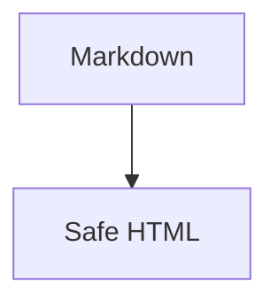

# MDLook Renderer Regression

Use this file after renderer changes. It is intentionally compact and covers common Markdown that should render safely in Quick Look.

## Inline Text

中文 English mixed text with **bold**, *italic*, `inline code`, ~~deleted text~~, and ==highlighted text== should keep spacing readable.

Escaped \*stars\*, \[brackets\], and \`ticks\` should render literally.

Visit https://example.com/docs and contact mailto:hello@example.com.

This link should render but should not keep the dangerous destination: [unsafe](javascript:alert(1)).

## Headings And Rules

Setext Heading
==============

Setext Subheading
-----------------

---

## Lists

- parent
  - child with `inline code`
  - ~~removed~~ text
- second parent

3. third item starts at 3
4. fourth item
   1. nested ordered
   2. nested second

## Tables And Tasks

| Left | Center | Right |
| :--- | :----: | ----: |
| A | B | C |
| 中文 | mixed text | `code` |

- [x] shipped
- [ ] polish

## Code Blocks

```swift
let message = "hello"
print(message)
```

~~~json
{"ok": true, "items": [1, 2, 3]}
~~~



Mermaid is intentionally shown as a labeled code block in v1; it is not executed.

## Images


Remote images are intentionally blocked:


## GitHub Callouts

> [!NOTE]
> Notes should have a distinct left border.

> [!TIP]
> Tips should have a distinct left border.

> [!IMPORTANT]
> Important notes should have a distinct left border.

> [!WARNING]
> Warnings should have a distinct left border.

> [!CAUTION]
> Caution notes should have a distinct left border.

## Currently Safe Fallbacks

Footnote syntax is preserved as regular Markdown text until footnotes become a dedicated feature.[^1]

Inline math `$a^2 + b^2 = c^2$` and block math are intentionally not executed in v1.

$$
a^2 + b^2 = c^2
$$

Raw HTML should be removed:

<script>alert("nope")</script>

[^1]: This footnote definition is a tracking sample for future support.
